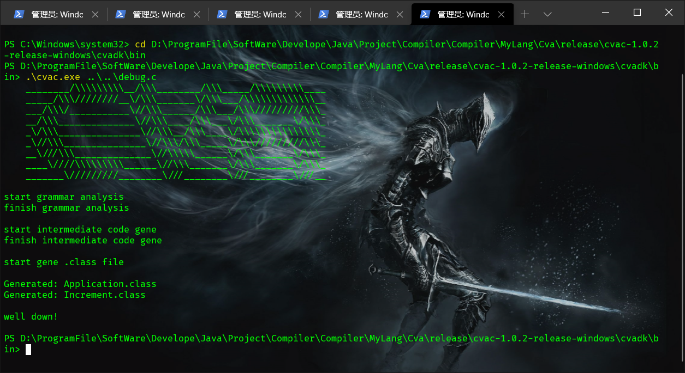
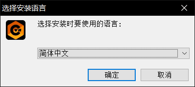

# Cva


[](https://www.cnblogs.com/misection/)


```text
   █████████  █████   █████   █████████  
  ███░░░░░███░░███   ░░███   ███░░░░░███ 
 ███     ░░░  ░███    ░███  ░███    ░███ 
░███          ░███    ░███  ░███████████ 
░███          ░░███   ███   ░███░░░░░███ 
░░███     ███  ░░░█████░    ░███    ░███ 
 ░░█████████     ░░███      █████   █████
  ░░░░░░░░░       ░░░      ░░░░░   ░░░░░ 
```

---
### Cva 是一个JVM语言, 未来希望兼容C, 达到C-to-JVM的效果


> [博客园教程地址](https://www.cnblogs.com/misection/p/14429145.html)
- **如果项目对您有帮助, 请点一点star, 谢谢!**
- 今天才整理好, 一会发布上去
- 未来的目标是兼容C, 支持C编译到JVM虚拟机上

#### 目前要准备春招实习, 所以项目暂停更新一段时间;
- 由于时间原因, 目前没有做系统的测试;

+ 目前文法基本属于Java子集, 支持简单的面向对象
+ 词法和语法前端手写
+ 面向目标平台 JVM 生成字节码
+ 已实现的编译优化：简易的常量折叠、不可达代码删除，基于到达定义分析的常量/拷贝传播，基于活性分析的死代码删除优化
- 由于目前还不稳定, 所以

# How to use

#### 您可以 goto release 下载发行版
- cva目前制作了windows exe installer与jar发行版, 目前为试发行, 还是存在着不少的bug
- 由于时间原因, 目前没有做命令行参数的支持, 这个是todo项目之一

##### release-jar
- jar版本速度更快, 同时意味着您可以跨平台使用之
```shell script
java -jar cvac.jar fileName
```
- 会将文件编译当前目录下的指定的文件


#### release-windows installer

- 使用 windows 安装包, 需要.NET framework3.5的支持
 其他方案如exe4j存在目前难以解决的路径问题
- 同时, 在使用cvac的同时建议您指定CvaDK的安装路径/bin为环境变量, 方便在命令行随时使用, 或者到bin目录下去编译cva文件
> PS: 目前 CvaDK使用的是Microsoft的IKVM, 希望以后能开发出CvaVM整套工具

#### 您也可以clone or 下载源码, 自行编译, 作者的编译环境是
> JDK  1.8 以上  
> 由于大量使用了Java8的函数式特性, 所以请您务必使用JDK8以上版本  
> Maven 3  
> 使用Maven管理项目  
#### 依赖
- 依赖仅仅有Junit进行测试, 但是目前由于时间原因, 还没有有规模地组织测试

# Cva语法

- Cva的语法目前与Java类似, 但是允许将main方法放在类外部, 其他

#### 示例文件请见 ./sample/

#### 由于项目目前还没有achieve, 所以一些特性还不支持, 只给出了一些简单的sample;

# 项目结构
- go 的使用是本来打算用go很棒棒的标准库的flag作为命令行参数接收以及启动胶水 
后来go和Java进程间通信始终出现着意想不到的bug且性能较差, 遂作罢   
后来想用Csharp作为启动器, Csharp调用Java比较简单, 发现可以直接用ikvm打包...
就直接用ikvmc编译了jar并用inno setup制作了发行版
- 项目中的C语言是cva源码, 因为C勉强有点代码提示, 所以目前Cva IDE 还没开发出来,
不会拒绝非.cva后缀的文件

```text
├─src
│  ├─main
│  │  ├─go // 暂时被这个小项目遗弃的go们
│  │  │  └─golang
│  │  │      ├─handler
│  │  │      └─main
│  │  ├─java
│  │  │  ├─cn
│  │  │  │  └─misection
│  │  │  │      └─cvac
│  │  │  │          ├─ast // 前端抽象语法树
│  │  │  │          │  ├─clas // Cva类
│  │  │  │          │  ├─decl // Cva 声明
│  │  │  │          │  │  └─nullobj // 所有nullobj package都是空对象模式的空对象 下同
│  │  │  │          │  ├─entry // Cva 主类, Cva程序的入口
│  │  │  │          │  ├─expr // Cva 表达式
│  │  │  │          │  │  ├─nonterminal // 非终结符
│  │  │  │          │  │  │  ├─binary // 二元表达式
│  │  │  │          │  │  │  ├─ternary // 三元表达式
│  │  │  │          │  │  │  └─unary // 一元表达式
│  │  │  │          │  │  ├─nullobj // 空对象
│  │  │  │          │  │  └─terminator // 终结符
│  │  │  │          │  ├─method // Cva 方法
│  │  │  │          │  ├─program // Cva 语法树根节点
│  │  │  │          │  ├─statement // Cva声明
│  │  │  │          │  │  └─nullobj 
│  │  │  │          │  └─type // Cva类型
│  │  │  │          │      ├─advance // 进阶类型, String, array && 指针, 目前只实现了string
│  │  │  │          │      ├─basic // 基础类型, Java基本类型
│  │  │  │          │      └─reference // 引用类型, 其实string和array也是
│  │  │  │          ├─codegen
│  │  │  │          │  └─bst // backend syntax tree 编译器后端抽象语法树
│  │  │  │          │      ├─bclas
│  │  │  │          │      ├─bdecl
│  │  │  │          │      ├─bentry
│  │  │  │          │      ├─bmethod
│  │  │  │          │      ├─bprogram
│  │  │  │          │      ├─btype
│  │  │  │          │      │  ├─advance
│  │  │  │          │      │  ├─basic
│  │  │  │          │      │  └─reference
│  │  │  │          │      └─instructor
│  │  │  │          │          └─write
│  │  │  │          ├─config // 主要是条件编译的宏常量等
│  │  │  │          ├─constant // 常数池, TODO 将所有常数池以及package-info的常量用枚举重构
│  │  │  │          ├─io // 文件流读写
│  │  │  │          ├─lexer // 词法分析
│  │  │  │          ├─optimize // 编译优化
│  │  │  │          ├─parser // 语法分析
│  │  │  │          ├─pkg // Cva包管理
│  │  │  │          └─semantic // 语义分析
│  │  │  └─META-INF // 打包jar入口
│  │  └─resources
│  └─test // 单元测试
│      └─java
│          └─cn
│              └─misection
│                  └─cvac
│                      ├─ast
│                      ├─codegen
│                      │  └─bst
│                      │      └─instructor
│                      ├─lexer
│                      │  └─report
│                      └─unit
└─target
    // ... .class 文件...

```
#### 


---
# TODO
- 由于时间原因, 还没有测试每个分支
- 命令行参数
- 兼容C的超级Cva
- CvaNIO原生库
- 实现Java的Pkg, 进行Pkg编译, 选取pkg替代Java的package关键字, call取代Java的import关键字
- CvaDK, 实现HashMap
- CvaVM Cva虚拟机
- CvaIDE 

- 把所ast type加后缀type不然要混淆  

